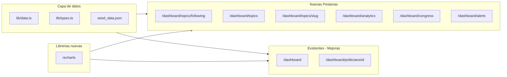

# Plan: Expansion completa UX/UI de Alethia

## Estado actual del dashboard

El sidebar tiene 5 pestanas: Panorama, Legisladores, Ejecutivo Nacional, Ranking, Comparador. Los datos del seed ya contienen topics (10), discourse_gaps, consistency_scores, alliance_scores, speeches, speech_analyses, contradictions y bills -- mucha data que hoy **no se visualiza** adecuadamente.

No hay libreria de graficos: todo se hace con barras CSS manuales. No hay forma de seguir temas ni recibir alertas.

## Arquitectura de la expansion




## 1. Libreria de graficos: Recharts

Instalar `recharts` (la mas ligera y compatible con React Server Components via client wrappers).

Crear carpeta `frontend/src/components/charts/` con wrappers reutilizables:

- `**area-chart.tsx**` -- grafico de area para tendencias temporales (uso: evolucion de consistency scores, actividad por mes)
- `**bar-chart.tsx**` -- barras horizontales/verticales (uso: discourse gaps, votos por partido)
- `**radar-chart.tsx**` -- araña multidimensional (uso: perfil tematico de un legislador)
- `**pie-chart.tsx**` -- donut chart (uso: distribucion de votos si/no/abstencion)
- `**line-chart.tsx**` -- lineas multiples (uso: comparar tendencias entre legisladores/partidos)

Todos seran `"use client"` components con estilos consistentes (colores muted-blue, muted-red, muted-green, muted-gold).

## 2. Pestana "Mis Temas" (`/dashboard/topics/following`)

**Proposito:** El usuario selecciona los temas que le interesan y ve un dashboard personalizado de esos temas.

**Datos necesarios en seed:** Ya existen `topics` con mention_count, bill_count, speech_count, momentum_score, discourse_gap_score. Agregar un campo `user_followed_topics` al seed con IDs de topics que "Sofía" sigue (mock).

**Nuevos tipos:**

- `UserPreferences` en [types.ts](frontend/src/lib/types.ts): `{ followed_topic_ids: string[], followed_politician_ids: string[] }`

**Nuevas funciones en [data.ts](frontend/src/lib/data.ts):**

- `getUserFollowedTopics()` -- devuelve topics que el usuario sigue
- `getTopicActivity(topicId)` -- speeches + votes + bills relacionados a un topic
- `getTopicTrend(topicId)` -- datos de momentum a lo largo del tiempo (simulados por mes)

**UI de la pagina:**

- Header: "Mis Temas" + boton "Administrar temas"
- Grid de cards por tema seguido: nombre, discourse gap badge, momentum sparkline (AreaChart pequeno), ultimos bills presentados, cantidad de menciones recientes
- Cada card es clickeable a `/dashboard/topics/[slug]`
- Panel lateral o modal para agregar/quitar temas (client component con estado local)

## 3. Pestana "Temas" (`/dashboard/topics` + `/dashboard/topics/[slug]`)

**Proposito:** Catalogo completo de topicos legislativos con detalle por tema.

**Lista (`/dashboard/topics`):**

- Grid de cards (como legisladores) con: nombre del tema, color_hex, discourse_gap_score con badge de severidad, mention_count, bill_count, momentum_score como barra
- Filtros: area de politica (policy_area), ordenar por gap/momentum/menciones

**Detalle (`/dashboard/topics/[slug]`):**

- Hero con nombre, descripcion, policy_area
- **Discourse Gap visual:** BarChart grande comparando menciones en recinto vs proyectos aprobados
- **Quien habla de este tema:** lista de legisladores que tienen consistency_scores para este topic_id, con su score y grade
- **Evolucion temporal:** AreaChart con momentum simulado (12 meses)
- **Proyectos de ley relacionados:** tabla de bills filtrados por policy_area, con status badges (draft/committee/floor/passed/enacted/rejected)

**Datos:** La mayoria ya existe. Agregar funciones:

- `getTopicBySlug(slug)` en data.ts
- `getPoliticiansByTopic(topicId)` -- filtra consistency_scores para ese topic
- `getBillsByPolicyArea(area)` -- filtra bills

## 4. Pestana "Analisis" (`/dashboard/analytics`)

**Proposito:** Capas de analisis avanzado con graficos interactivos.

**Secciones de la pagina (scrollable con anchors):**

### 4a. Tendencia de coherencia

- **LineChart** con la evolucion promedio de consistency_score por partido a lo largo del tiempo (simular 12 data points por partido)
- Toggle por partido para mostrar/ocultar lineas
- Datos mock: agregar `monthly_consistency` al seed (array de { month, party_id, avg_score })

### 4b. Mapa de alianzas

- **Tabla interactiva** mostrando top 20 pares de alianzas (alliance_scores ordenados por alignment_rate)
- BarChart horizontal con alignment_rate por par
- Filtro por partido o legislador
- Datos: ya existen en `alliance_scores`

### 4c. Brechas discurso vs. realidad

- **BarChart** grande dual: menciones en recinto (azul) vs leyes aprobadas (verde) por tema
- Cada barra muestra el gap_ratio como numero
- Datos: ya existen en `discourse_gaps`

### 4d. Distribucion de votos

- **PieChart** donut: distribucion global de yes/no/abstain/absent en todas las vote_positions
- Segundo PieChart por partido seleccionado
- Datos: computar desde vote_positions

### 4e. Actividad legislativa por mes

- **AreaChart** con sesiones, discursos y votaciones por mes (agrupar sessions por date)
- Datos: ya existen sessions con fecha

**Nuevas funciones en data.ts:**

- `getVoteDistribution(partyId?)` -- cuenta posiciones
- `getMonthlyActivity()` -- agrupa sessions/speeches/votes por mes
- `getTopAlliances(limit)` -- top alianzas
- `getMonthlyConsistencyByParty()` -- datos simulados

## 5. Pestana "Hoy en el Congreso" (`/dashboard/congress`)

**Proposito:** Feed en tiempo real (mock) de lo que paso hoy en el Congreso.

**Datos mock:** Agregar al seed un array `congress_today` con 5-8 eventos recientes:

```
{ id, type: "session"|"vote"|"bill"|"speech", title, description, date, related_ids, icon }
```

**UI:**

- Header: "Hoy en el Congreso" + fecha actual
- Timeline vertical con cards de evento: icono por tipo, hora, titulo, descripcion breve, link a entidad relacionada
- Panel lateral con "Proximas sesiones" (cards con fecha y titulo)
- Seccion "Proyectos en movimiento": bills con status reciente (committee->floor, etc.)

**Nuevas funciones:**

- `getCongressToday()` -- devuelve eventos de hoy
- `getUpcomingSessions()` -- sesiones futuras (mock)
- `getRecentBillMovements()` -- bills con status reciente

## 6. Seccion "Alertas" (`/dashboard/alerts`)

**Proposito:** Centro de notificaciones del usuario.

**Datos mock:** Agregar `user_alerts` al seed:

```
{ id, type: "contradiction"|"topic_surge"|"bill_advance"|"vote", title, description, date, read, related_id }
```

**UI:**

- Lista de alertas con badge de tipo, titulo, descripcion, fecha relativa ("hace 2h")
- Toggle leidas/no leidas
- Boton "Marcar todas como leidas"
- Icono de campanita en el header del dashboard con badge de conteo (ya existe el boton en dashboard/page.tsx)

**Nuevas funciones:**

- `getUserAlerts()` -- devuelve alertas del usuario

## 7. Mejoras al Dashboard Panorama existente

- Reemplazar las barras CSS de "Tus temas hoy" por un **RadarChart** o mantener barras pero con sparklines
- Agregar un mini **AreaChart** de actividad semanal (7 dias) en la seccion stats
- El feed "Lo que paso hoy" enlaza a `/dashboard/congress`

## 8. Mejoras al Perfil de Legislador existente

- Agregar **RadarChart** con scores por tema (reemplaza barras planas en la seccion de temas)
- Agregar **PieChart** donut de distribucion de votos del legislador (si/no/abstencion/ausente)
- En la seccion de trayectoria: imagenes placeholder por institucion

## 9. Navegacion actualizada del sidebar

```
Panorama          (dashboard)
Mis Temas         (topics/following)     [NUEVO]
Temas             (topics)               [NUEVO]
Legisladores      (politicians)
Ejecutivo Nacional(executive)
Analisis          (analytics)            [NUEVO]
Hoy en el Congreso(congress)             [NUEVO]
Ranking           (ranking)
Comparador        (compare)
---
Alertas           (alerts)               [NUEVO]
```

## Archivos clave a modificar

- [frontend/src/lib/types.ts](frontend/src/lib/types.ts) -- nuevos tipos (UserPreferences, CongressEvent, UserAlert, MonthlyData)
- [frontend/src/lib/data.ts](frontend/src/lib/data.ts) -- ~12 nuevas funciones de acceso a datos
- [backend/seeds/seed_demo.py](backend/seeds/seed_demo.py) -- generar datos mock nuevos (congress_today, user_alerts, monthly_consistency, user_preferences)
- [frontend/src/data/seed_data.json](frontend/src/data/seed_data.json) -- regenerado
- [frontend/src/components/layout/dashboard-sidebar.tsx](frontend/src/components/layout/dashboard-sidebar.tsx) -- nuevos items de nav
- 5 nuevos archivos `page.tsx` + 6-7 nuevos componentes de charts

## Orden de implementacion sugerido

Dividido en 3 bloques para no romper nada:

**Bloque A -- Fundacion (charts + datos):** Instalar recharts, crear wrappers, extender seed y data.ts con todos los datos nuevos.

**Bloque B -- Paginas nuevas:** Temas, Mis Temas, Analisis, Hoy en el Congreso, Alertas. Crear una por una, actualizar sidebar progresivamente.

**Bloque C -- Mejoras a existentes:** Graficos en Panorama, Perfil de Legislador, y polish general.